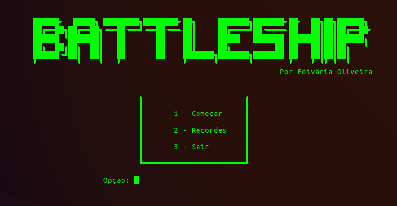

# **Battleship**

*Edivânia Pontes de Oliveira*

*edivaniap@ufrn.edu.br*

#### **Descrição**
___

Batalha naval é um jogo clássico de tabuleiro de dois jogadores, no qual os jogadores têm de adivinhar em que posição estão os navios do oponente e bombardeá-los.

- Modos: contra computar ?ou outro jogador?

- Tabuleiro: 10x10

- Navios: 1 porta-aviões [1x4], 2 encouraçados [1x3], 3 cruzadores [1x2] e 4 submarinos [1x1]

 
#### **O Jogo**
___

O jogo é dividido em duas fases: o posicionamento de navios e a batalha. Vence quem afundar todos os navios do adversário primeiro.

*Posicionamento*: dispor todos os navios no tabuleiro ?de forma que nenhum navio seja adjacente a outro?.

*Batalha*: cada jogador tem direito de atirar uma vez em uma posição informada por coordenadas. Caso o jogador acerte o tiro em algum navio, ele tem direito a mais uma jogada. Para afundar um navio, deve-se atingi-lo em todas as posições que ele ocupa.

#### **Requisitos**
___

1. Cadastro de nome de jogadores
2. Pontuação de jogadores em cada partida
3. Histórico de partidas
4. Visual modo texto
5. IA para partida contra PC
6. Posicionamento manual
7. Posicionamento aleatório

